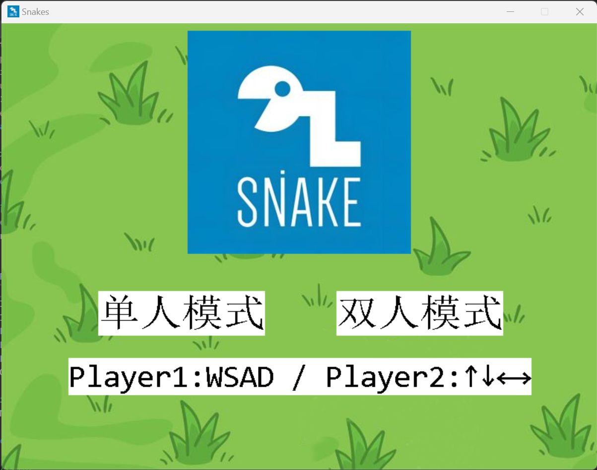
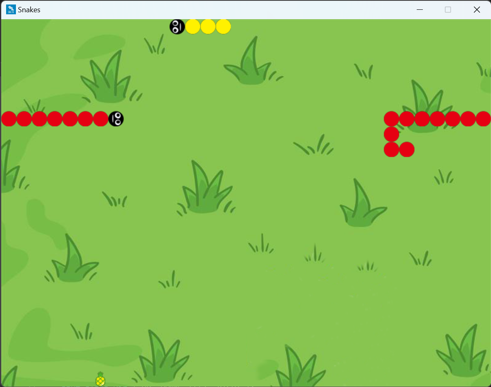

# 贪吃蛇 双人版（C++ & EasyX）

## 项目简介/Project Introduction

一款基于C++和EasyX开发的小游戏：双人贪吃蛇C++

如果您喜欢这个项目，请给我一个🌟Star🌟吧！

## 项目特点/Project Features

开发难度低：项目总体难度低，适合初学者参考学习。

图形界面：引入EasyX图形库，使得游戏界面更加美观。

模式可选：支持单人模式和双人模式。

参数可调：移动速度定义于代码开头部分，可根据需要进行调整。

## 游戏规则/Game Rules

在游戏中，玩家将操纵贪吃蛇在地图中行动。

贪吃蛇初始长度为3，每吃到一个食物，长度增加1。

直到贪吃蛇撞到蛇的身体，游戏结束。

让自己尽可能变长！！

### 单人模式
- 操纵：WASD

### 双人模式
- 玩家1操纵：WASD
- 玩家2操纵：方向键

### 默认参数
- 每0.3秒移动一格

## 开发环境/Development Environment
- Windows 11
- Visual Studio 2022
- EasyX 2023_大暑版

## 安装使用/Installation & Usage
### 玩家
[>点击这里<](https://github.com/CCLMSY/Snakes/releases/download/Release/Release.zip)下载并解压压缩包，双击 `Snakes.exe` 运行游戏。
### 开发者
确保你的系统已安装 EasyX 图形库。
1. 克隆仓库：
   ```sh
   git clone https://github.com/CCLMSY/Snakes
   ```
2. 打开 `Snakes/main.cpp` 文件，可查看和编辑项目源码。代码中用到的素材位于 `Snakes/src` 文件夹下。
3. 如果你使用的是 Visual Studio ，且环境搭建正确，可以在 Visual Studio 中打开 `Snakes.sln` 解决方案文件，可以直接查看项目并编译运行。

## 项目结构/Project Structure
```
.
├── README.md
├── Screenshots
│   ├── 1.png
│   └── 2.png
├── Snakes
│   ├── src
│   │   ├── *.png
│   │   └── *.wav
│   ├── Snakes.*
│   └── main.cpp
└── Snakes.sln
```

## 素材来源/Source of Materials
背景图片；来源于网络，经个人修改，如有侵权，请联系删除。

方块图案：[阿里巴巴矢量图标库](https://www.iconfont.cn/)

## 项目截图/Project Screenshots




## 许可协议/License
[MIT Lisence] © 2023 CCLMSY